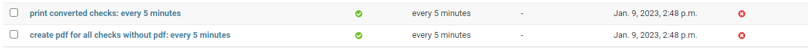

# SheepFish test task

API service for convert checks to pdf and print them on printer

## How to run
1. Run this commands
```shell
git clone https://github.com/Kitazuka/SheepFish_test.git
python -m venv venv
venv\Scripts\activate # on Windows
source venv/bin/activate # on macOS
pip install -r requirements.txt
```
2. You need to create .env file (you can see an example in .env.sample)
3. Enable Docker and run this:
```shell
docker-compose up --build
```
4. Run migrations and load default data:
```shell
python manage.py migrate
python manage.py loaddata printers_fixtures.json
python manage.py createsuperuser # to create user and get access to admin page
```
5. Create periodic tasks on admin page (.../admin/django_celery_beat/periodictask/)
 (you can use your interval)
6. Enable celary and celery beat:
```shell
celery -A SheepFish_test worker -l info -P gevent
```
```shell
celery -A SheepFish_test beat -l INFO --scheduler django_celery_beat.schedulers:DatabaseScheduler
```

# Tips:

1. An example of an order when creating a check:
```json
{
  "dish": 2,
  "another dish": 1
}
```
- "dish" - name of dish, 
- 1 - count of this dish in order